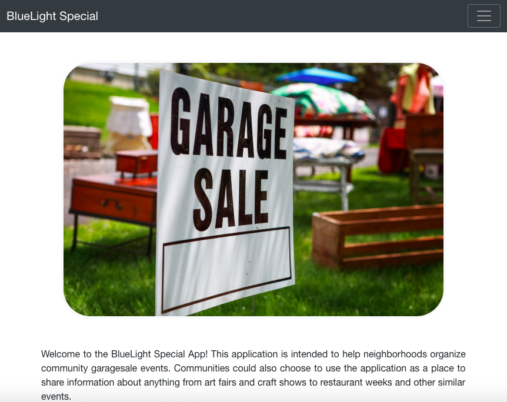

# bluelight-special

Welcome to BlueLight Special. This application is intended to allow communities to organize neighborhood garage sale events. A list of sales is available to anyone who views the site. Creating, editing and deleting a sale requires authentication. Authenticated users also have access to a map of all sales through Google Maps Platform.

This application was created to meet the requirements for the final project in Flatiron Academy's Fullstack Web Development program.



## Getting started

These instructions will get you a copy of the project up and running on your local machine for development and testing purposes.

### Prerequisites
```
  Github
  Ruby 2.3.3
  Rails 5.2.1
  React 16.9.0
```

### Installation

To get started, run the following commands:
  ```
  git clone https://github.com/dmcgrann/bluelight-special.git
  cd bluelight-special
  npm install
  rake db:migrate
  rake start
  ```

## Deployment

The site will be available at http://localhost:3000.

## Contributing

Contributing Bug reports and pull requests are welcome on GitHub at https://github.com/dmcgrann/bluelight-special.

## License

This project is licensed under the MIT License - see the [LICENSE.md](LICENSE.md) file for details.
